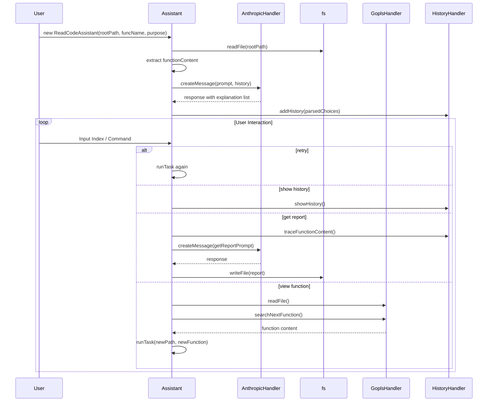

## tldr;

１： LLMにGo言語のコードを読ませるVS Code 拡張機能 Repilot を作りました

https://marketplace.visualstudio.com/items?itemName=coffeecupjapan.repilot&ssr=false#overview

https://github.com/YmBIgo/Repilot

２： CNCFのGo言語プロジェクト（Kubernetes, argo-cdなど）で関数を見つけ出すのは倍くらいのスピードになった感触ある
３： LLMに重要な関数候補を出してもらい、関数の中身をLLMに渡すのを再帰的に続ける仕組み

## <導入> なぜ作ったか？

ちょうど半年くらい前の2024年9~10月に、個人的に Kubernetes 周りの技術に凝っていた時期があって、Kuberenetes のオープンソースの Go言語のコードを読んでいた頃がありました。

ただ読めば読むほど、kubectlやetcdとの接続に留まらない、Kubenetesの奥深さに絶望するだけでした。具体的には、kube-scheduler, kubelet, kube-aggregator から Kubeneretesの周辺機能である様々な CNCF のプロジェクト...と、自分一人の個人の力ではとても全て追うのは不可能だと思っていました。

---

時は経って、2025年。
会社でエンジニアが中心となって企画を出すという取り組みに取り組んでいた自分は、いくつかの生成AIを活用した案を出していました。

https://qiita.com/YmBIgo/items/6458c50bf5ea96b678a0

https://qiita.com/YmBIgo/items/f7039758d2d512c7fa9a

そんな時、いよいよ新しい別の案を出さなければならない1週間前に、ふと vulunhuntr で使われていた「LLMとLSPを組み合わせて、セキュリティスキャンをする」という考え方を、大規模コード読解にも使えるのではないかと考えつきました。
実際、私の会社の現場はおそらく通常よりも大規模なコードを取り扱っているのですが、それをいきなり新卒や新人などが慣れていく必要があり、しんどそうという声もあったそうです。
またコードリーディングに特化したLLMツールを少し検索したところ、Cursor（LSP使用なし？あくまでもベクトル検索っぽい）かもう廃業したものしか検索では出てきませんでした（認知バイアスかもしれませんが...）

ということで、vulnhuntr の実装の

1. LLMにセキュリティ的に***不審な箇所候補***をいくつか挙げてもらう
2. LSPで関数ジャンプして関数の中身を取得
3. 1〜2を繰り返す

の流れを、少し改善して、

1. LLMに読んでもらうエントリポイントの関数とコードリーディングの目的を入力
2. 1の情報を元に、LLMにエントリーポイントの関数から関数の全体を取得し、入力された目的とあう***関数の候補を取得***
3. ユーザーにジャンプした関数を選んでもらい、LSPで候補関数にジャンプし再度関数の中身を取得
4. 2〜3を繰り返す

のようにできると考え、

https://zenn.dev/coffeecupjp/articles/89bb2b40ced6eb

にも書いてあるような CLIツール・ウェブアプリを作りました。
ただ、CLIツールより VS Code拡張機能の方が使いやすい点が多いと考えたので、今回はVS Code拡張機能を作りました。

https://marketplace.visualstudio.com/items?itemName=coffeecupjapan.repilot&ssr=false#overview

（英語拙いかもしません...）
***Re***ading Co***pilot*** で Repilot です。
今回作ったのは、***Go言語に特化したもの***ですが、LSPを使いこなし、プロンプトを育てていけば別言語版も作れると思います。是非とも作ってみたいし、皆さんにも挑戦して欲しいものですね。
VS Code拡張機能のコードも載せますね。

https://github.com/YmBIgo/Repilot

実際に このツールを使って、今では Kubenetes の難しそうだった、scheduler や kubelet の機能の大枠の重要な関数をざっくり理解できるようになり、argo-cd や prometheus でもコードの理解の役に立つ情報をコスパよく見れていると思います。

## <機能紹介> 何ができるか？

まずは、簡単なデモを作ったので見てもらえればと思います（間違って音が入ってしまったので、音楽を入れています。音声注意）

導入が長くなりましたが、機能を紹介します。
機能は主に、5つあります。

1. LLMがコードを読んで見つけた関数候補から、ユーザーが深堀したい関数を深掘る機能
2. 木構造になる関数の検索の履歴を表示し、木構造のいずれかの関数に戻って検索ができる機能
3. ここまでで調べた関数の経路のサマリーをレポートとして出す機能
4. 現段階でLLMが見ている関数を表示する機能
5. APIキー・言語やgopls(Go言語のLSP)のパスなど設定を保存する機能

1つ1つ説明しますね。

#### LLMがコードを読んで見つけた関数候補から、ユーザーが深堀したい関数を深掘る機能

導入でも触れましたが、今回のVS Code拡張を動かすには、「エントリポイントの関数とコードリーディングの目的」を入力してもらう必要があります。
それを入力してはじめて、LLM はエントリーポイントの関数の内容から重要そうな関数候補を取得します。以下のような画面が表示されます。
深ぼって検索する必要があると思うので、その場合は、候補の数字（0〜4）を再度入力すると、深ぼって検索ができます。
ちなみに、5を入力すると再度同じ関数を同じ場所から再検索もできます。

#### 木構造になる関数の検索の履歴を表示し、木構造のいずれかの関数に戻って検索ができる機能

前の機能で、「候補の数字（0〜4）を再度入力」すれば検索ができると書きましたが、できるのは検索だけではありません。その他にもある機能の１つが、この機能です。
6を入力すると、以下のような関数を検索した履歴が木構造で表示されます。
ただ表示されるだけではなく、木構造の各ノードにある hash値を入力することで、その場所から再検索もできます。
コードリーディングをしていると、間違った探索をすることはしょっちゅうだと思います。そのような時に簡単に戻れるようにしたい、というのがこの機能の意図です。

#### ここまでで調べた関数の経路のサマリーをレポートとして出す機能

「深堀り検索」以外の機能の２つ目です。
7を入力すると、ここまで調べた経路をLLMに投げて、サマリーのレポートを表示できます。
この拡張機能を使っていると、コードリーディングした結果物がないと、コードリーディングの結果が頭に残らないという弊害もあるので、それをサポートしてあげようという機能です。

#### 現段階でLLMが見ている関数を表示する機能

「深堀り検索」以外の機能の第３弾です。
8を入力すると、現在LLMが見ているファイルの内容を表示します。VS Codeの新しいタブに今LLMが見ているファイルが、見ている箇所が選択された状態で表示されます。
LLMがおかしいことを言っていないか確認するために作った機能です。結局コードを読むんですけど...

#### APIキー・言語やgopls(Go言語のLSP)のパスなど設定を保存する機能

最後に設定の画面です。
このページは、Chat View の上に出ている「Here」ボタンを押せば遷移でき、４つの設定を設定できます。Cline の元コードを参考に、secret か global state か判別したので、多分大丈夫でしょう。
API はすみません。Claude しか対応していません...が、今のところはClaude以外はあまり考えていません（安定性の問題があって、3.5 sonnet を使っています...）。
もちろん、言語設定もできるので、日本語でも使えます！

## 実装概要

一般的な VS Code 拡張の開発と同じように、バックエンド側の実装の `core` と フロント側の実装の `React の Web-View` の２つに分ける構造をしています。

#### バックエンドとフロントのデータ通信

バックエンドでは、vscodeライブラリの`postMessage`を使って送信の操作を・`vscode.onDidReceiveMessage`で受信の操作を行っています。
フロントエンドでは、vscodeライブラリの`postMessage`を使って送信の操作を・`addEventListener("message")`で受信の操作を行っています。
送受信しているのは JSONフォーマットのString と Object だったはずです（分けているのは怠惰なだけだったので、どちらかに統一するなど修正の余地はありそうですね）。

#### 実ロジック

VS Code ではない CLI ツールのコードをそのままコピーしてきたようなものですが...

https://github.com/YmBIgo/CodeReadingAssistant/tree/main/cli

https://github.com/YmBIgo/Repilot/blob/main/src/core/assistant.ts

ChatGPTにマーメイド図にメインとなる assistant.ts を書かせたら、下に書いたみたいな風になるみたいですね（そういえば機能に、既存のマーメイド図を描かせる機能を入れてもいいですね）。
基本的には、runTask を再帰的に呼んでいて、runHistoryPoint(検索履歴のhash値から過去の経路を再探索する機能)なんかが少し例外な感じですかね。
このマーメイド図に書いている、HistoryHandlerが履歴を制御するもの・GoplsHanlderがGoplsの制御ロジックが詰まっている場所になります。

よかったら、覗きに来てくださいね！

#### VS Code ならではの開発

なかなか検索しても出てこないので、Clineの実際のコードを見て開発していました。
もしかしたらおかしいところがあると思いますが、動いているしヨシ！
また覚えていたら、そこら辺のノウハウも記事にするかもしれません。

https://qiita.com/yusu79/items/44520c4c67864b0bb3e9

の記事には助けられました。この場でお礼を申し上げます。

#### プロンプトを育てる難しさ

数日前に書いた記事の、ここら辺を参考にしてください。

https://qiita.com/YmBIgo/items/209ab1602d095ac51b69#golang-%E3%81%A7-code-reading-agent-%E3%82%92%E4%BD%9C%E3%82%8B%E4%B8%8A%E3%81%A7%E3%81%AE%E9%9A%9C%E5%A3%81

## 効果

スピード・正確性を兼ね備えたツールだと思っています。
現状、数日で Kubelet, kube-scheduler, argo-cd, prometheus のコードを読んだ気になれました。
とはいえ、ユースケースとしては、ざっと重要な関数を把握できることが強みだと思うので、実際のコードを読む前に慣らしとして入ればその後のコードリーディングが捗る、というものが大きいのかなとは思います。

https://qiita.com/YmBIgo/items/209ab1602d095ac51b69#code-reading-agent-%E3%81%A8-%E7%9B%AEgrep-%E3%81%AE%E3%82%B3%E3%83%BC%E3%83%89%E3%83%AA%E3%83%BC%E3%83%87%E3%82%A3%E3%83%B3%E3%82%B0%E3%81%AE%E9%81%95%E3%81%84

## <使い方ガイド> 公開されているので、今すぐ使えますよ！

VS Code 拡張機能検索で、「repilot」と検索すれば出てきます。

https://marketplace.visualstudio.com/items?itemName=coffeecupjapan.repilot&ssr=false#overview

#### 注意

使い時は、「Command + Shift + p」でコマンドパレットを開き、そこから `repilot.openInNewTab` を探してみてください！

Mac では動いたのですが、WindowsやLinuxとかは試していませんが、Webpack様が難しいことを吸収してくれていると思いたいです。
***もし問題があったら、ここのコメント欄でもいいので報告していただけると嬉しいです！***

使い方は上に書いた通りですが、日本語が上手くないので、分からないことがあったら聞いてくださると嬉しいです。

皆様も一緒に CNCF のプロジェクトを conquer しましょう！

## 今後の展開

VS Code 拡張機能は意外と長時間悩むことなく作れたので、次は C か JavaScript か Java の LSP で作りたいですね。
また細かい部分で、直したい部分もある（マーメイド図出力など）のでそこも直したいですね。

## 🚀 Repilot を試してみる

- 👉 [VS Code 拡張機能をインストールする](https://marketplace.visualstudio.com/items?itemName=coffeecupjapan.repilot)
- 📦 [GitHub でコードを見る](https://github.com/YmBIgo/Repilot)
- 🐦 感想・バグ報告は @YmBIgo まで！